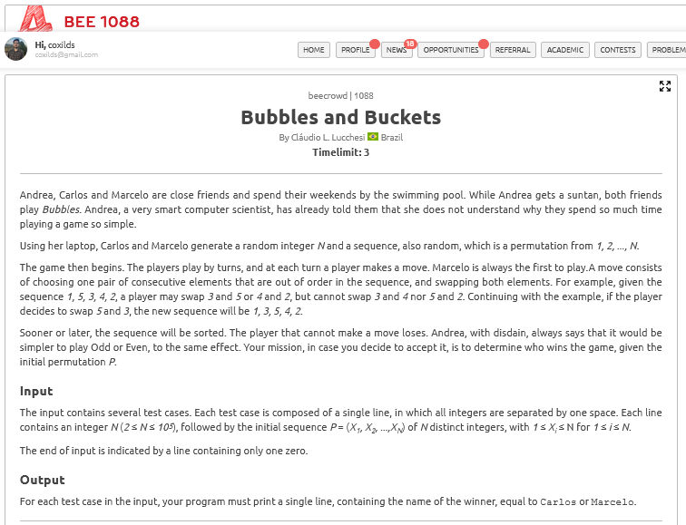
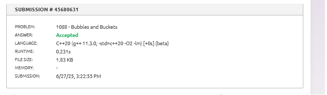

# A questão

# Estratégia:

Dividir e Conquistar com Contagem de Inversões

A estratégia adotada foi aplicar o algoritmo de **Merge Sort modificado** para contar o número de inversões necessárias para ordenar a sequência. Cada inversão representa uma troca válida no jogo Bubbles, em que os jogadores alternam ao escolher pares consecutivos fora de ordem.

Se o número de inversões for **par**, Carlos vence; se for **ímpar**, Marcelo vence — pois Marcelo sempre joga primeiro.

# Algoritmo utilizado

- Utilização de **Merge Sort** com contador de inversões.
- A cada merge, se `arr[i] > arr[j]`, isso representa uma inversão.
- A complexidade é **O(N log N)**, eficiente para até 100.000 elementos.

# Resultado

O algoritmo atinge o resultado necessário para ser aceito.

