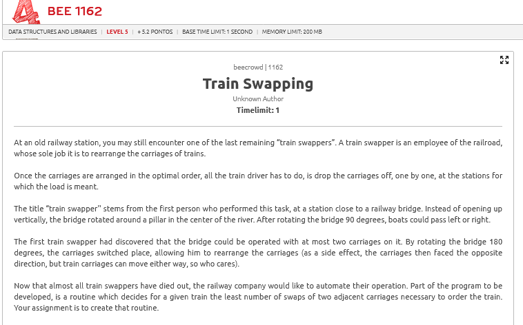
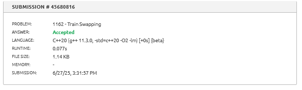

# A questão

# Estratégia:

Dividir e Conquistar com Contagem de Inversões

Neste problema, o objetivo é determinar o número mínimo de trocas entre pares adjacentes necessários para ordenar um vetor (representando os vagões de um trem).

A estratégia ideal é usar o algoritmo de **Merge Sort modificado** para contar o número de **inversões** no vetor, cada inversão correspondendo a uma troca entre dois vagões fora de ordem.

# Algoritmo utilizado

- Implementação do **Merge Sort** com contagem de inversões.
- Ao encontrar `arr[i] > arr[j]`, somamos o número de elementos restantes à esquerda (`mid - i`) como inversões.
- Complexidade: **O(N log N)** — eficiente mesmo para vetores grandes.

# Resultado

O algoritmo retorna corretamente o número mínimo de trocas, e foi aceito pela plataforma.

