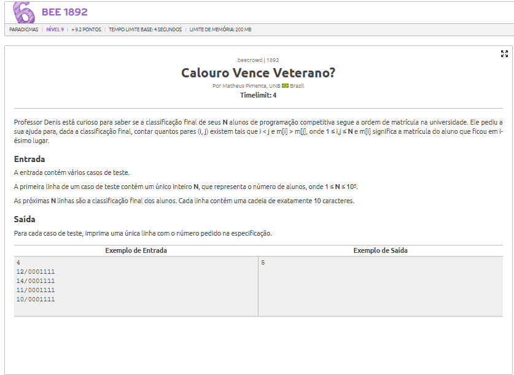
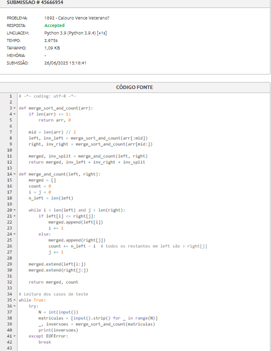

# A questão

# Estratégia:

1. Dividir o vetor ao meio recursivamente.

2. Contar inversões à esquerda e à direita.

3. Contar inversões entre os lados, durante a etapa de merge.

4. A soma total dessas inversões representa a resposta para aquele caso de teste.

# Algoritmo utilizado
Dividir e Conquistar:
Baseado no Merge Sort, com complexidade O(N log N).
Durante a ordenação, são somadas as inversões ao fundir os dois lados.

# Resultado
O algoritmo atinge o resultado necessário para seraceito

