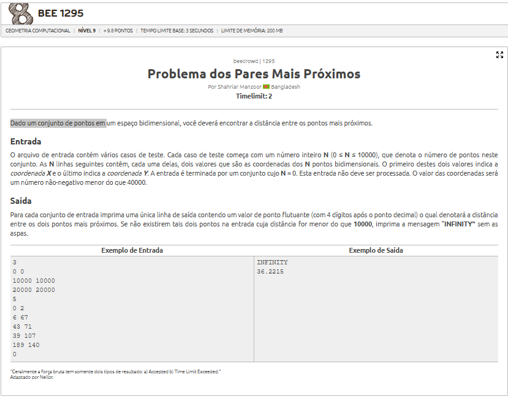
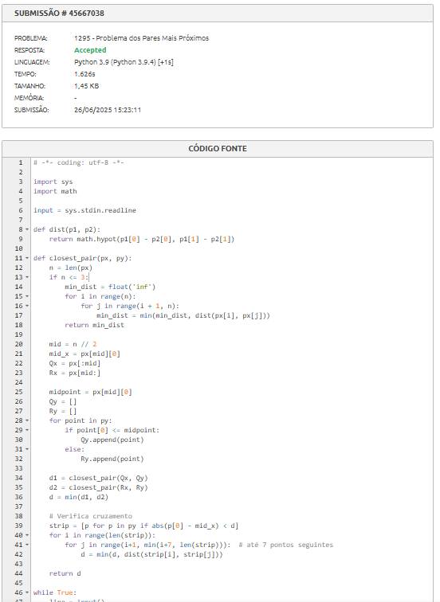

# A questão

# Estratégia:

Geometria Computacional com Dividir e Conquistar

A abordagem utilizada foi de Par Mais Próximo com Dividir e Conquistar, que atinge complexidade O(N log N).

A estratégia divide o conjunto de pontos por coordenada x, calcula recursivamente a menor distância nos dois lados e, por fim, verifica se existe algum par de pontos cruzando a divisão que possua distância menor do que as já encontradas.

Durante essa verificação cruzada:

Só são considerados pontos que estão a no máximo "d" unidades da divisão.

E apenas até 7 pontos vizinhos no eixo y são verificados por ponto, garantindo eficiência.

# Algoritmo utilizado
Pontos são ordenados por coordenadas x e y.

A menor distância entre pares é calculada recursivamente nas divisões esquerda e direita.

Uma verificação extra é feita no strip central para pares que cruzam a divisão.

embrando que a disância entre pontos em um plano euclidiano é dado por: 

$dist(p_1,p_2) = \sqrt{(x_2 - x_1)^2 + (y_2 - y_1)^2} $

# Resultado
O algoritmo atinge o resultado necessário para seraceito

